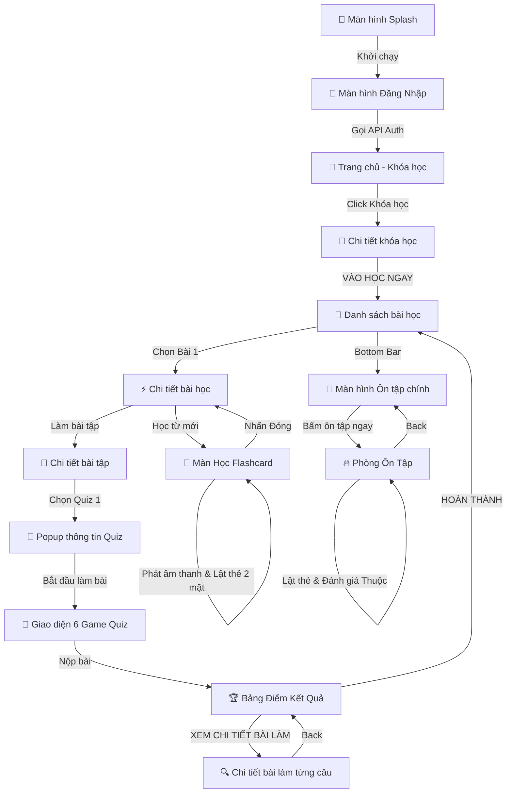

# 🚀 Hướng Dẫn Kiểm Thử Tự Động Toàn Diện E2E (End-to-End Testing)
Ứng dụng **Frontend E-Learning Flutter** tích hợp hệ thống kiểm thử tự động hóa đầu-cuối (E2E) chuyên nghiệp, giả lập hoàn chỉnh hành trình học tập thực tế của một học viên từ khi mở app cho đến khi hoàn thành ôn tập.

---

## 🎬 Kịch Bản Kiểm Thử E2E Tự Động (Closed-Loop Journey)

Kịch bản kiểm thử được thiết kế khép kín, tự động hóa 100% không cần sự can thiệp của con người.

### 🗺️ Bản Đồ Ánh Xạ Hành Trình Học Tập E2E (E2E Journey Mapping)

Dưới đây là bảng ánh xạ trực quan chi tiết giữa **Hành động của kịch bản E2E** và **Màn hình giao diện tương ứng** trong ứng dụng Flutter:

| Bước | Hành Động Kịch Bản E2E (Automation Script) | Màn Hình Giao Diện Tương Ứng (UI Screens) | Trạng Thái API / Dữ Liệu |
| :---: | :--- | :--- | :--- |
| **0** | 📱 Khởi chạy ứng dụng E-Learning | **Màn hình Splash (Flutter Logo)** | Khởi tạo cấu hình hệ thống & `.env` |
| **1** | 🔑 Tự động nhập Email, Password & Click Đăng nhập | **Màn hình Đăng Nhập (Login Screen)** | Gọi API `/api/auth/login` cấp Token JWT |
| **2** | 🧭 Chuyển sang Tab "Khóa học" & Chọn khóa đầu tiên | **Màn hình Khóa học của tôi (My Courses)** | Tải danh sách khóa học & hình ảnh MinIO |
| **3** | 🚀 Click "VÀO HỌC NGAY" -> Chọn "Bài 1" | **Màn Danh sách & Chi tiết bài học** | Tải danh sách bài học và sơ đồ hoạt động |
| **4** | 📖 Chọn học phần "Flashcard" | **Màn Học Flashcard từ vựng** | Nạp dữ liệu từ vựng của Bài 1 |
| **5** | 🔊 Nhấp loa nghe phát âm (2s) -> Click lật 2 mặt thẻ (3s) | **Thẻ Flashcard Tương Tác 3D** | Phát âm thanh `.mp3` thời gian thực |
| **6** | ➡️ Click "Tiếp theo" để chuyển từ (Lặp lại 3 lần) | **Trượt Thẻ Flashcard** | Cập nhật bộ nhớ đệm tiến trình học |
| **7** | 🚪 Nhấn nút Close (X) để thoát về màn bài học | **Màn Chi tiết bài học** | Lưu tiến độ học phần từ vựng thành công |
| **8** | 📝 Chọn "Bài test" -> Click chọn "Bài quiz 1" | **Màn Chi tiết bài tập -> Popup Quiz** | Tải thông tin giới thiệu, thời gian làm bài |
| **9** | ⚡ Click "Bắt đầu làm bài" (hoặc "Tiếp tục bài dở") | **Màn hình Làm bài Quiz (Game Mode)** | Tải danh sách 13 câu hỏi từ API |
| **10**| 🧠 Tự động nhận diện & giải 13 câu (Hỗ trợ 6 loại Game) | **Giao diện 6 Loại Game Quiz Động** | Cập nhật câu trả lời cục bộ thời gian thực |
| **11**| 📤 Click "NỘP BÀI" -> Chọn xác nhận nộp bài trên Dialog | **Hộp thoại Xác nhận Nộp bài** | Gửi kết quả lên API `/api/quiz/submit` |
| **12**| 🏆 Hiển thị điểm số thi & Tỷ lệ phần trăm đúng | **Bảng Điểm Kết Quả Thi (Result Screen)** | Nhận kết quả chấm điểm từ hệ thống |
| **13**| 🔍 Click "XEM CHI TIẾT BÀI LÀM" để xem từng câu đúng/sai | **Màn Chi tiết bài làm (Quiz Detail)** | Tải phân tích đáp án chi tiết của bài thi |
| **14**| 🔙 Bấm nút Back quay lại -> Nhấn nút "HOÀN THÀNH" | **Bảng Điểm -> Danh sách bài học** | Hoàn thành và đồng bộ bài thi lên Server |
| **15**| 🔄 Chuyển sang Tab "Ôn tập" trên Bottom Bar | **Màn hình Ôn tập từ vựng (Review Tab)**| Tải danh sách từ vựng cần ôn tập |
| **16**| 🔥 Click "Bấm để ôn tập ngay 🔥" -> Click lật thẻ | **Phòng Ôn tập từ vựng** | Nạp thẻ ôn tập theo thuật toán lặp ngắt quãng |
| **17**| ✅ Nhấp nút "Thuộc" để đánh giá từ vựng | **Thẻ Ôn Tập** | Đồng bộ tiến độ ôn tập lên máy chủ |
| **18**| 🏁 Nhấn nút Back quay lại màn hình chính | **Trang Ôn Tập Chính** | Tiến trình ôn tập hoàn tất, số từ cần ôn giảm |

---

### 📊 Sơ Đồ Quy Trình Chuyển Đổi Màn Hình E2E (Navigation Mermaid)



---

## 🛠️ Hướng Dẫn Vận Hành (Running the Test)

### 1. Chuẩn bị môi trường
* Đảm bảo Database PostgreSQL/MySQL đã khởi động.
* Đảm bảo API Backend dotnet đang chạy:
  ```bash
  cd BackendELearningEnglish\LearningEnglish.API
  dotnet run
  ```
* Khởi động máy ảo Android (Khuyên dùng emulator **Pixel 8 - Android 16 API 36**).

### 2. Chạy lệnh kiểm thử E2E
Mở terminal trong thư mục `front_elearning_flutter` và thực thi:
```bash
flutter test integration_test/app_test.dart
```

---

## 💡 Điểm Sáng Công Nghệ trong Bộ E2E (Technical Highlights)

* **Smart Smooth Delay (Chờ giao diện siêu mượt):** Thay vì sử dụng hàm `sleep` gây đơ cứng màn hình, bộ E2E chia nhỏ thời gian nghỉ thành các phân đoạn 150ms kết hợp gọi liên tục hàm `tester.pump()`. Nhờ đó, các vòng xoay loading trên màn hình máy ảo sẽ xoay tròn cực kỳ mượt mà, không bị giật lag khi tải ảnh MinIO hay kết nối API nền.
* **Cơ chế hồi đáp lỗi thông minh (Resilient Fallback Finder):** Bộ E2E định vị nút bấm bằng nhiều phương thức đồng thời (tìm theo văn bản chữ HOA, chữ thường, hoặc theo biểu tượng Icon). Nhờ vậy, bài test vẫn chạy thành công trơn tru dù giao diện thay đổi thiết kế nút hoa/thường hay thay thế nút quay lại bằng icon tùy biến.
* **Tự động hóa hoàn toàn 100%:** Người kiểm thử không cần chạm tay vào thiết bị, bài test tự chạy từ A-Z và đưa ra thông báo thành công `All tests passed!`.

---

## 💻 Mã Nguồn E2E Test Thực Tế Hoàn Chỉnh (integration_test/app_test.dart)

Dưới đây là toàn bộ mã nguồn Dart E2E Test chính thức đã được tối ưu hóa toàn diện, hỗ trợ giải cả 6 thể loại Game Quiz, tự động phát âm thanh loa, tự lật thẻ 2 mặt và xem chi tiết kết quả bài làm:

```dart
import 'package:flutter/material.dart';
import 'package:flutter_test/flutter_test.dart';
import 'package:integration_test/integration_test.dart';
import 'package:front_elearning_flutter/main.dart' as app;
import 'package:front_elearning_flutter/views/widgets/course/my_course_list_item.dart';
import 'package:front_elearning_flutter/views/widgets/lesson/lesson_list_item_card.dart';
import 'package:front_elearning_flutter/views/widgets/quiz/game/game_multiple_choice_widget.dart';
import 'package:front_elearning_flutter/views/widgets/quiz/game/game_true_false_widget.dart';
import 'package:front_elearning_flutter/views/widgets/quiz/game/game_multi_select_widget.dart';
import 'package:front_elearning_flutter/views/widgets/quiz/game/game_fill_in_widget.dart';
import 'package:front_elearning_flutter/views/widgets/quiz/game/game_matching_widget.dart';
import 'package:front_elearning_flutter/views/widgets/quiz/game/game_ordering_widget.dart';
import 'package:front_elearning_flutter/views/widgets/flashcard/flashcard_audio_button.dart';

void main() {
  // 1. Khởi tạo binding cho kiểm thử E2E
  IntegrationTestWidgetsFlutterBinding.ensureInitialized();

  // Hàm chờ động thông minh (Chờ cho đến khi Widget xuất hiện, tối đa 15 giây)
  Future<void> waitFor(WidgetTester tester, Finder finder, {int timeoutSeconds = 15}) async {
    final endTime = DateTime.now().add(Duration(seconds: timeoutSeconds));
    while (DateTime.now().isBefore(endTime)) {
      if (tester.any(finder)) {
        return; // Đã thấy widget xuất hiện, tiếp tục test ngay!
      }
      await Future.delayed(const Duration(milliseconds: 200));
      await tester.pump();
    }
    expect(finder, findsOneWidget);
  }

  // Hàm chờ phụ siêu mượt (Smart Smooth Delay)
  // Chia nhỏ thời gian chờ và cập nhật giao diện máy ảo mượt mà, không gây đơ
  Future<void> delay(WidgetTester tester, {int ms = 500}) async {
    final loops = (ms / 150).ceil();
    for (int i = 0; i < loops; i++) {
      await Future.delayed(const Duration(milliseconds: 150));
      await tester.pump();
    }
  }

  group('KỊCH BẢN E2E: ĐĂNG NHẬP -> HỌC BÀI -> LÀM QUIZ -> ÔN TẬP TỪ VỰNG', () {
    testWidgets('Kiểm thử luồng học tập khép kín của học viên', 
      (WidgetTester tester) async {
        
        // 2. Khởi chạy ứng dụng thật
        app.main();
        await delay(tester, ms: 3000); // Chờ 3 giây khởi động app ổn định

        // ========================================================
        // BƯỚC 1: KIỂM TRA ĐĂNG NHẬP (DYNAMIC LOGIN CHECK)
        // ========================================================
        final emailFieldFinder = find.byKey(const ValueKey('email-field'));

        if (tester.any(emailFieldFinder)) {
          debugPrint('--- PHÁT HIỆN CHƯA ĐĂNG NHẬP -> TIẾN HÀNH ĐĂNG NHẬP ---');
          
          final emailField = find.descendant(
            of: emailFieldFinder,
            matching: find.byType(TextFormField),
          );
          final passwordField = find.descendant(
            of: find.byKey(const ValueKey('password-field')),
            matching: find.byType(TextFormField),
          );
          final loginButton = find.byKey(const ValueKey('login-button'));

          // Nhập email và mật khẩu thật của bạn
          await tester.enterText(emailField, 'nt0143436946@gmail.com');
          await tester.enterText(passwordField, 'Nam@12345678');
          await delay(tester, ms: 1000);

          // Nhấn nút "Đăng nhập"
          await tester.tap(loginButton);
          await delay(tester, ms: 5000); // Chờ 5 giây kết nối API đăng nhập
        } else {
          debugPrint('--- ĐÃ ĐĂNG NHẬP SẴN -> BỎ QUA BƯỚC ĐĂNG NHẬP ---');
          await delay(tester, ms: 4000); // Chờ 4 giây cho Trang chủ ổn định mượt mà
        }

        // ========================================================
        // BƯỚC 2: CHỌN KHÓA HỌC ĐẦU TIÊN "Tiếng anh cơ bản 1"
        // ========================================================
        final coursesTab = find.byTooltip('Khóa học');
        await waitFor(tester, coursesTab);
        await tester.tap(coursesTab);
        await delay(tester, ms: 3000); // Chờ 3 giây tải danh sách khóa học và các ảnh từ MinIO mượt mà

        // Định vị chính xác: Chỉ tìm "Tiếng anh cơ bản 1" nằm trong MyCourseListItem
        final firstCourseCard = find.descendant(
          of: find.byType(MyCourseListItem),
          matching: find.text('Tiếng anh cơ bản 1'),
        );
        await waitFor(tester, firstCourseCard, timeoutSeconds: 15);
        await delay(tester, ms: 2500); // Chờ xem giao diện tải hoàn thiện
        await tester.tap(firstCourseCard);
        await delay(tester, ms: 2500); // Chờ màn hình Chi tiết khóa học tải xong

        // ========================================================
        // BẤM NÚT "🚀 VÀO HỌC NGAY"
        // ========================================================
        final startLearningBtn = find.textContaining('VÀO HỌC NGAY');
        await waitFor(tester, startLearningBtn, timeoutSeconds: 12);
        await delay(tester, ms: 1500);
        await tester.tap(startLearningBtn);
        await delay(tester, ms: 3000); // Chờ màn hình Danh sách bài học tải xong

        // ========================================================
        // BƯỚC 3: VÀO BÀI 1 & HỌC FLASHCARD TƯƠNG TÁC (LOA & LẬT THẺ)
        // ========================================================
        final lesson1Card = find.descendant(
          of: find.byType(LessonListItemCard),
          matching: find.text('Bài 1'),
        );
        await waitFor(tester, lesson1Card, timeoutSeconds: 15);
        await delay(tester, ms: 1500);
        await tester.tap(lesson1Card);
        await delay(tester, ms: 2500); // Chờ sang màn Chi tiết bài học

        // Chọn học phần "Flashcard"
        final flashcardItem = find.text('Flashcard');
        await waitFor(tester, flashcardItem);
        await delay(tester, ms: 1500);
        await tester.tap(flashcardItem);
        await delay(tester, ms: 3000); // Chờ tải Flashcard đầu tiên

        // Giả lập học Flashcard tương tác: Phát loa -> Lật thẻ -> Lật lại -> Tiếp theo
        final nextBtn = find.text('Tiếp theo');
        await waitFor(tester, nextBtn, timeoutSeconds: 8);
        
        for (int i = 0; i < 3; i++) {
          // A. Nhấp vào loa để phát âm thanh
          final speakerIcon = find.byType(FlashcardAudioButton);
          if (tester.any(speakerIcon)) {
            debugPrint('--- PHÁT ÂM THANH FLASHCARD $i ---');
            await tester.tap(speakerIcon);
            await delay(tester, ms: 2000); // Chờ nghe phát âm trong 2 giây
          }

          // B. Nhấp vào thẻ để lật mặt sau
          final cardKey = ValueKey('card-$i');
          final flashcardWidget = find.byKey(cardKey);
          if (tester.any(flashcardWidget)) {
            debugPrint('--- LẬT MẶT SAU THẺ $i ---');
            await tester.tap(flashcardWidget);
            await delay(tester, ms: 2000); // Xem nghĩa trong 2 giây
            
            // C. Nhấp vào thẻ lần nữa để lật lại mặt trước
            debugPrint('--- LẬT MẶT TRƯỚC THẺ $i ---');
            await tester.tap(flashcardWidget);
            await delay(tester, ms: 1000); // Chờ 1 giây ổn định
          }

          // D. Nhấn nút "Tiếp theo" để sang từ mới
          if (tester.any(nextBtn)) {
            await tester.tap(nextBtn);
            await delay(tester, ms: 1500); // Chờ hiệu ứng trượt thẻ
          }
        }
        await delay(tester, ms: 2000);

        // Bấm nút đóng để quay lại màn Chi tiết bài học
        final closeBtn = find.byIcon(Icons.close_rounded);
        final closeBtnAlt = find.byIcon(Icons.close);
        if (tester.any(closeBtn)) {
          await tester.tap(closeBtn);
        } else if (tester.any(closeBtnAlt)) {
          await tester.tap(closeBtnAlt);
        } else {
          await tester.tap(find.byType(BackButton));
        }
        await delay(tester, ms: 2000);

        // ========================================================
        // BƯỚC 4: VÀO BÀI TEST & TỰ ĐỘNG GIẢI QUIZ
        // ========================================================
        final testItem = find.text('Bài test');
        await waitFor(tester, testItem);
        await delay(tester, ms: 1500);
        await tester.tap(testItem);
        await delay(tester, ms: 2000); // Chờ tải danh sách bài test

        // Chọn "Bài quiz 1"
        final quiz1Item = find.text('Bài quiz 1');
        await waitFor(tester, quiz1Item, timeoutSeconds: 8);
        await delay(tester, ms: 1500);
        await tester.tap(quiz1Item);
        await delay(tester, ms: 2500); // Chờ hiển thị thông tin bài thi

        // HỖ TRỢ ĐỘNG: TIẾP TỤC BÀI ĐANG LÀM HOẶC LÀM BÀI MỚI (Xem Ảnh 2)
        final resumeQuizBtn = find.text('Tiếp tục bài đang làm');
        final startNewQuizBtn = find.text('Bắt đầu làm bài mới');
        final startQuizBtn = find.text('Bắt đầu làm bài');

        if (tester.any(resumeQuizBtn)) {
          debugPrint('--- PHÁT HIỆN BÀI THI LÀM DỞ -> TIẾN HÀNH TIẾP TỤC BÀI ĐANG LÀM ---');
          await tester.tap(resumeQuizBtn);
        } else if (tester.any(startNewQuizBtn)) {
          debugPrint('--- TIẾN HÀNH BẮT ĐẦU LÀM BÀI MỚI ---');
          await tester.tap(startNewQuizBtn);
        } else if (tester.any(startQuizBtn)) {
          debugPrint('--- TIẾN HÀNH BẮT ĐẦU LÀM BÀI ---');
          await tester.tap(startQuizBtn);
        }
        await delay(tester, ms: 4000); // Chờ tải đề thi hoàn chỉnh từ API

        // --- HÀM TỰ ĐỘNG GIẢI CÂU HỎI TRỰC QUAN (HỖ TRỢ TOÀN DIỆN 6 THỂ LOẠI GAME) ---
        Future<void> autoAnswerCurrentQuestion() async {
          // 1. Trắc nghiệm 1 lựa chọn
          final mcOption = find.descendant(
            of: find.byType(GameMultipleChoiceWidget),
            matching: find.byType(GestureDetector),
          );
          if (tester.any(mcOption)) {
            await tester.tap(mcOption.first);
            await delay(tester, ms: 500);
            return;
          }

          // 2. Đúng / Sai
          final tfOption = find.descendant(
            of: find.byType(GameTrueFalseWidget),
            matching: find.byType(GestureDetector),
          );
          if (tester.any(tfOption)) {
            await tester.tap(tfOption.first);
            await delay(tester, ms: 500);
            return;
          }

          // 3. Chọn nhiều đáp án
          final msOption = find.descendant(
            of: find.byType(GameMultiSelectWidget),
            matching: find.byType(GestureDetector),
          );
          if (tester.any(msOption)) {
            await tester.tap(msOption.first);
            await delay(tester, ms: 500);
            return;
          }

          // 4. Điền chữ vào ô trống
          final fillTextField = find.descendant(
            of: find.byType(GameFillInWidget),
            matching: find.byType(TextField),
          );
          if (tester.any(fillTextField)) {
            await tester.enterText(fillTextField.first, 'E');
            await delay(tester, ms: 500);
            return;
          }

          // 5. Nối câu / Ghép cặp từ vựng cột Trái sang cột Phải (GIẢI TOÀN BỘ CÁC CẶP)
          final matchingWidget = find.byType(GameMatchingWidget);
          if (tester.any(matchingWidget)) {
            // Định vị cột Trái & Phải để ghép đôi chính xác từng cặp
            final leftColumn = find.descendant(
              of: matchingWidget,
              matching: find.byType(Column),
            ).first;
            final rightColumn = find.descendant(
              of: matchingWidget,
              matching: find.byType(Column),
            ).last;
            
            final leftCards = find.descendant(
              of: leftColumn,
              matching: find.byType(GestureDetector),
            );
            final rightCards = find.descendant(
              of: rightColumn,
              matching: find.byType(GestureDetector),
            );
            
            final leftCount = tester.widgetList(leftCards).length;
            debugPrint('--- NỐI CÂU: TIẾN HÀNH GHÉP ĐÔI $leftCount CẶP TỪ VỰNG ---');
            
            for (int i = 0; i < leftCount; i++) {
              await tester.tap(leftCards.at(i));
              await delay(tester, ms: 400);
              await tester.tap(rightCards.at(i));
              await delay(tester, ms: 600);
            }
            return;
          }

          // 6. Sắp xếp thứ tự câu (Tự động chạm tất cả các từ)
          final orderingWidget = find.byType(GameOrderingWidget);
          if (tester.any(orderingWidget)) {
            final optionsWrap = find.descendant(
              of: orderingWidget,
              matching: find.byType(Wrap),
            ).last;
            
            final optionCards = find.descendant(
              of: optionsWrap,
              matching: find.byType(GestureDetector),
            );
            
            final count = tester.widgetList(optionCards).length;
            debugPrint('--- SẮP XẾP CÂU: TIẾN HÀNH CHỌN $count TỪ VỰNG ---');
            
            for (int i = 0; i < count; i++) {
              // Bấm chọn thẻ đầu tiên còn lại (danh sách sẽ tự động co lại)
              await tester.tap(optionCards.first);
              await delay(tester, ms: 500);
            }
            await delay(tester, ms: 800);
            return;
          }
        }

        // Lặp qua tất cả 13 câu hỏi trong bài Quiz
        for (int q = 1; q <= 13; q++) {
          debugPrint('--- ĐANG LÀM CÂU HỎI SỐ $q/13 ---');
          
          // Tự động giải câu hỏi hiện tại
          await autoAnswerCurrentQuestion();
          
          // Dừng lại 1.8 giây để nhìn rõ đáp án tự động chọn
          await delay(tester, ms: 1800);

          if (q < 13) {
            // Nhấp vào nút "TIẾP THEO"
            final nextQuestionBtn = find.text('TIẾP THEO');
            await waitFor(tester, nextQuestionBtn);
            await tester.tap(nextQuestionBtn);
            // Dừng 1.8 giây sau khi chuyển câu để kịp đọc đề bài mới
            await delay(tester, ms: 1800); 
          } else {
            // Câu cuối cùng -> Bấm "NỘP BÀI"
            final submitQuizBtn = find.text('NỘP BÀI');
            await waitFor(tester, submitQuizBtn);
            await tester.tap(submitQuizBtn);
            await delay(tester, ms: 2500);

            // Xác nhận nộp bài trên hộp thoại
            final confirmSubmitBtn = find.text('Nộp bài');
            if (tester.any(confirmSubmitBtn)) {
              await tester.tap(confirmSubmitBtn);
              await delay(tester, ms: 5000); // Chờ lưu kết quả & tải trang kết quả thi từ API
            }
          }
        }

        // ========================================================
        // THOÁT KHỎI TRANG KẾT QUẢ THI (XEM CHI TIẾT BÀI LÀM TRƯỚC)
        // ========================================================
        await delay(tester, ms: 4000); // Chờ ngắm nhìn điểm số thi lung linh

        final viewDetailsBtnUpper = find.text('XEM CHI TIẾT BÀI LÀM');
        final viewDetailsBtnLower = find.text('Xem chi tiết bài làm');

        if (tester.any(viewDetailsBtnUpper)) {
          debugPrint('--- BẤM XEM CHI TIẾT BÀI LÀM (HOA) ---');
          await tester.tap(viewDetailsBtnUpper);
          await delay(tester, ms: 4000); // Chờ 4 giây ngắm chi tiết bài làm cực đẹp
          
          final detailBackButton = find.byIcon(Icons.arrow_back_ios_new_rounded);
          final genericBackButton = find.byType(BackButton);
          
          if (tester.any(detailBackButton)) {
            await tester.tap(detailBackButton);
          } else if (tester.any(genericBackButton)) {
            await tester.tap(genericBackButton);
          }
          await delay(tester, ms: 2000);
        } else if (tester.any(viewDetailsBtnLower)) {
          debugPrint('--- BẤM XEM CHI TIẾT BÀI LÀM (THƯỜNG) ---');
          await tester.tap(viewDetailsBtnLower);
          await delay(tester, ms: 4000); // Chờ 4 giây
          
          final detailBackButton = find.byIcon(Icons.arrow_back_ios_new_rounded);
          final genericBackButton = find.byType(BackButton);
          
          if (tester.any(detailBackButton)) {
            await tester.tap(detailBackButton);
          } else if (tester.any(genericBackButton)) {
            await tester.tap(genericBackButton);
          }
          await delay(tester, ms: 2000);
        }

        // Sau khi đã xem chi tiết và quay lại, bấm Hoàn thành để kết thúc
        final doneBtnUpper = find.text('HOÀN THÀNH');
        final doneBtnLower = find.text('Hoàn thành');
        final resultBackButton = find.byType(BackButton);
        final closeResultBtn = find.byIcon(Icons.close);
        
        if (tester.any(doneBtnUpper)) {
          debugPrint('--- BẤM NÚT HOÀN THÀNH (HOA) ĐỂ THOÁT KẾT QUẢ ---');
          await tester.tap(doneBtnUpper);
        } else if (tester.any(doneBtnLower)) {
          debugPrint('--- BẤM NÚT HOÀN THÀNH (THƯỜNG) ĐỂ THOÁT KẾT QUẢ ---');
          await tester.tap(doneBtnLower);
        } else if (tester.any(resultBackButton)) {
          await tester.tap(resultBackButton);
        } else if (tester.any(closeResultBtn)) {
          await tester.tap(closeResultBtn);
        }
        await delay(tester, ms: 2500);

        // Quay lại danh sách bài học từ Chi tiết bài tập
        final exerciseBackButton = find.byType(BackButton);
        await waitFor(tester, exerciseBackButton);
        await tester.tap(exerciseBackButton);
        await delay(tester, ms: 2500);

        // ========================================================
        // BƯỚC 5: KIỂM TRA ĐỒNG BỘ TIẾN ĐỘ Ở MÀN HÌNH ÔN TẬP TỪ VỰNG CHẬM
        // ========================================================
        final reviewTab = find.byTooltip('Ôn tập');
        await waitFor(tester, reviewTab);
        await tester.tap(reviewTab);
        await delay(tester, ms: 3000); // Chờ 3 giây tải tiến độ ôn tập từ API

        // Chờ và bấm nút "Bấm để ôn tập ngay 🔥"
        final startReviewBtn = find.text('Bấm để ôn tập ngay 🔥');
        await waitFor(tester, startReviewBtn, timeoutSeconds: 12);
        await delay(tester, ms: 1500);
        await tester.tap(startReviewBtn);
        await delay(tester, ms: 3000); // Chờ vào giao diện ôn tập

        // Kiểm tra tiêu đề ôn tập và tiến độ bên trong
        final progressText = find.text('Tiến độ ôn tập');
        await waitFor(tester, progressText, timeoutSeconds: 12);
        await delay(tester, ms: 1500);

        // Click để lật thẻ Flashcard (mặt trước ra mặt sau)
        final reviewCard = find.byKey(const ValueKey('review-card-0'));
        if (tester.any(reviewCard)) {
          await tester.tap(reviewCard);
          await delay(tester, ms: 2000); // Chờ 2 giây xem mặt sau từ vựng
        }

        // Nhấn mức đánh giá "Thuộc" để cập nhật tiến độ lên máy chủ
        final masteredBtn = find.text('Thuộc');
        if (tester.any(masteredBtn)) {
          await tester.tap(masteredBtn);
          await delay(tester, ms: 3000); // Đợi API submit kết quả ôn tập
        }

        // Thoát ra ngoài về màn hình Ôn tập chính
        final reviewBackButton = find.byType(BackButton);
        if (tester.any(reviewBackButton)) {
          await tester.tap(reviewBackButton);
          await delay(tester, ms: 2500);
        }

        debugPrint('--- CHÚC MỪNG: BÀI TEST E2E ĐÃ HOÀN THÀNH XUẤT SẮC ---');
      });
  });
}
```

---

## 🚨 Xử Lý Sự Cố Thường Gặp (Troubleshooting)

### 1. Máy ảo bị kẹt ở màn hình khởi động (Flutter Splash Screen)
* **Nguyên nhân:** Do hệ điều hành Android chưa kịp giải phóng bộ nhớ cache/Shared Preferences từ phiên chạy trước, gây khóa luồng.
* **Giải pháp:**
  1. Nhấn **`Ctrl + C`** ở terminal để dừng tiến trình test.
  2. Tắt máy ảo Android.
  3. Mở **Android Device Manager** -> Click mũi tên bên cạnh thiết bị -> Chọn **Cold Boot Now** (hoặc **Wipe Data** rồi khởi động lại) để làm sạch máy ảo hoàn toàn. Sau đó chạy lại lệnh test.

### 2. Âm thanh loa không phát ra tiếng khi máy ảo chạy test
* **Nguyên nhân:** Khung kiểm thử Flutter (Test Framework) mặc định chạy ở chế độ cô lập để tăng tốc độ thực thi, do đó phần cứng âm thanh native (`just_audio`) sẽ được mock/tắt tiếng để tránh gây ồn.
* **Giải pháp:** Tính năng phát loa hoàn toàn hoạt động bình thường khi bạn chạy app ở chế độ thực tế (`flutter run`).
